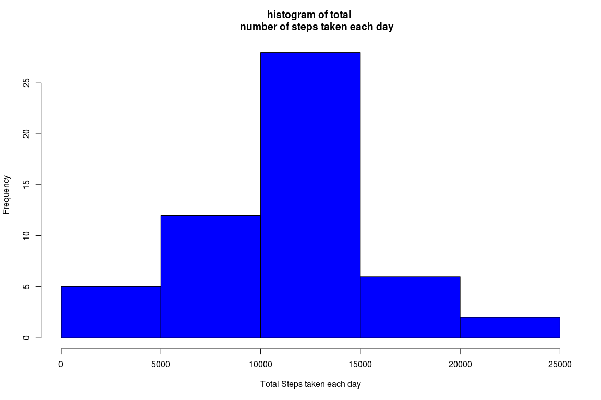
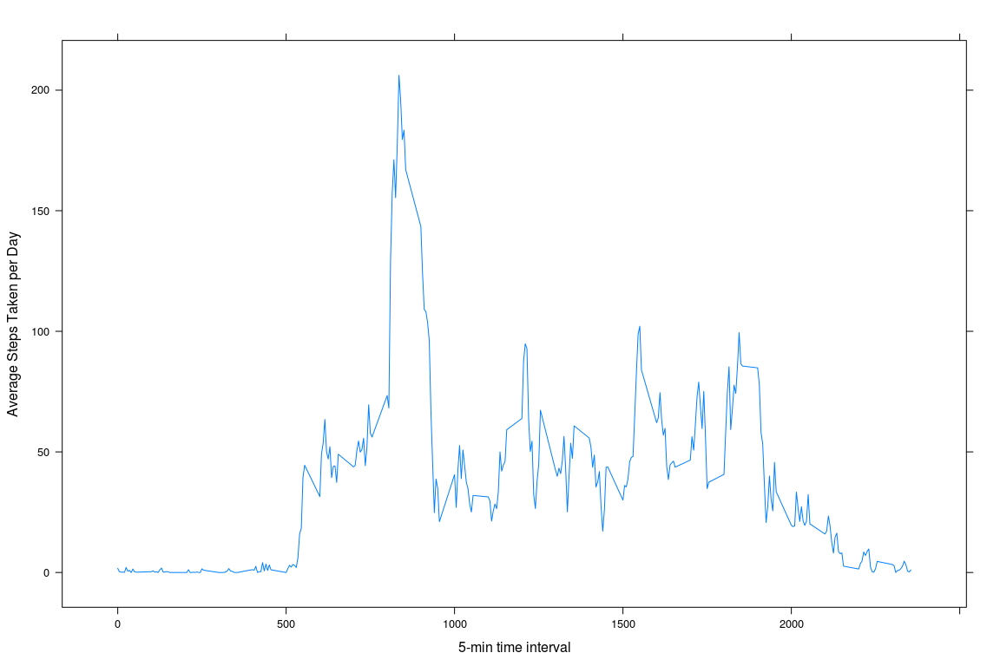
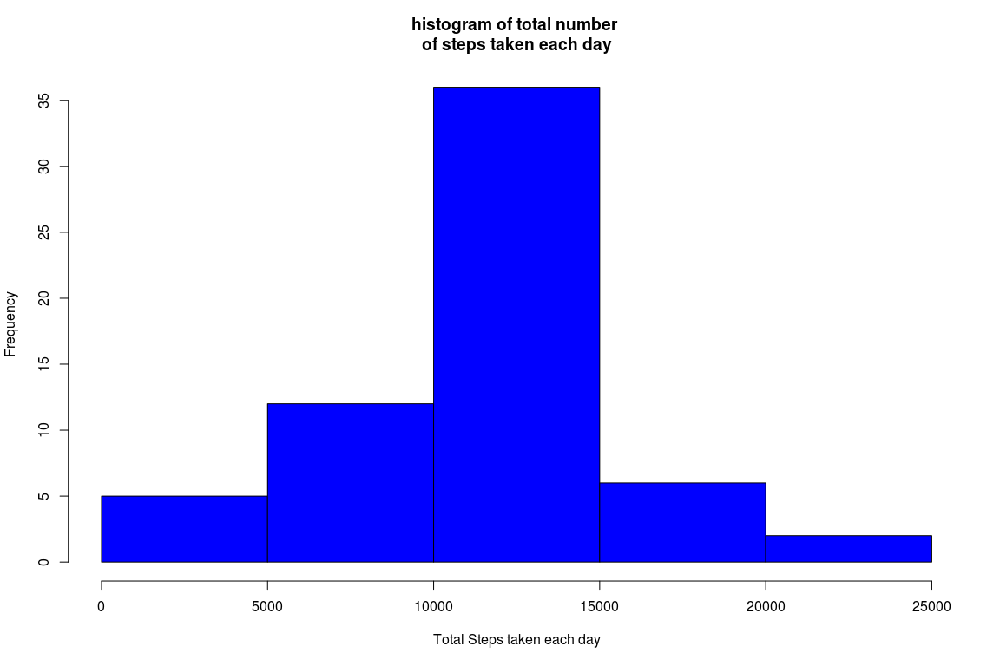
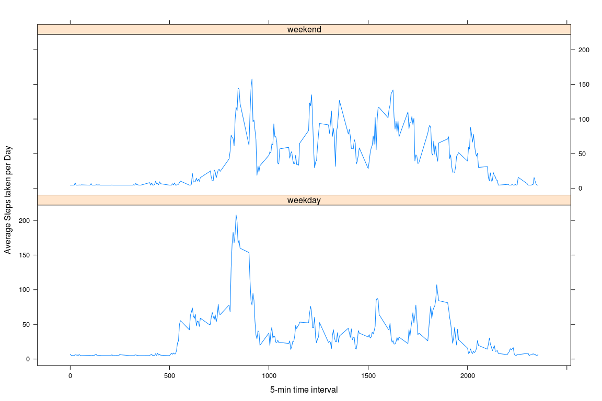

library(dplyr)  
library(lattice)


##  Loading and preprocessing the data
### Load the data (i.e.read.csv)

```r
unzip("/home/mledala/datascientist/reproducible_research/project1/repdata_data_activity.zip")
data <- read.csv("./activity.csv",sep=",")
```

## What is mean total number of steps taken per day?
### Calculate the total number of steps taken per day

```r
modified_data <- na.omit(data)
tot_steps_perday <- summarize(group_by(modified_data,date), sumsteps=sum(steps))
```

### Make a histogram of the total number of steps taken each day

```r
hist(tot_steps_perday$sumsteps,col="blue",xlab="Total Steps taken each day", main="histogram of total 
     number of steps taken each day")
```

<!-- -->

## Calculate the mean and median of the total number of steps taken per day

```r
options(scipen=1,digits=2)
mean_tot_steps_perday =mean(tot_steps_perday$sumsteps)
median_tot_steps_perday = median(tot_steps_perday$sumsteps)
```

The mean of the total number of steps taken per day is 10766.19 and the median of the total number
of steps taken per day is 10765 

## What is the average daily activity pattern?
### Make a time series plot (i.e. type = "l") of the 5-minute interval (x-axis) and the average number of steps taken, averaged across all days (y-axis)

```r
avg_steps_perday <- aggregate(steps~interval,data=modified_data, mean)
xyplot(steps~interval,avg_steps_perday,type="l",xlab="5-min time interval",
               ylab="Average Steps Taken per Day")
```

<!-- -->

### Which 5-minute interval, on average across all the days in the dataset, contains the maximum number of steps?

```r
x<-which.max(avg_steps_perday$steps)
avg_steps_perday[x,1]
```

```
## [1] 835
```
the 5-minute interval, on average across all the days in the dataset that contains the maximum number of steps is 835.


## Imputing missing values
### Calculate and report the total numer of missing values in the dataset (i.e the total number of rows with NA s)

```r
y=sum(!complete.cases(data))
```
The total number of missing values in the dataset is 2304.

### Create a new dataset that is equal to the original dataset but with the missing data filled in.

```r
filled_data<-data
filled_data$steps[is.na(filled_data$steps)]=mean(filled_data$steps,na.rm=TRUE)
```

### Make a histogram of the total number of steps taken and Calculate and report the mean and median total number of steps taken each day

```r
options(scipen=1,digits=2)
filled_tot_steps_perday <- summarize(group_by(filled_data,date), sumsteps=sum(steps))
hist(filled_tot_steps_perday$sumsteps,col="blue",xlab="Total Steps taken each day", main="histogram of total number 
of steps taken each day")
```

<!-- -->

```r
filled_mean_tot_steps_perday =mean(tot_steps_perday$sumsteps)
filled_median_tot_steps_perday = median(filled_tot_steps_perday$sumsteps)
```
The mean total number of steps per day is 10766.19 and median total number of steps per day 
is 10766.19.


### Do these values differ from the estimates from the first part of the assignment? What is the impact of imputing missing data on the estimates of the total daily number of steps?
Yes. The mean total number of steps remains same 10766.19 but median total number of steps has changed from 10765
to 10766.19.

## Are there differences in activity patterns between weekdays and weekends?
### Create a new factor variable in the dataset with two levels – “weekday” and “weekend” indicating whether a given date is a weekday or weekend day.

```r
new_data<- mutate(filled_data, weektype=ifelse(weekdays(as.Date(filled_data$date))=="Saturday" | weekdays(as.Date(filled_data$date))=="Sunday",
"weekend","weekday"))
```
### Make a panel plot containing a time series plot (i.e. type = "l") of the 5-minute interval (x-axis) and the average number of steps taken, averaged across all weekday days or weekend days (y-axis). 

```r
new_data1<-aggregate(steps ~ interval + weektype, data=new_data,mean)
xyplot(steps~interval | weektype,new_data1,type="l",layout=c(1,2),xlab="5-min time interval",
               ylab="Average Steps taken per Day")
```

<!-- -->
